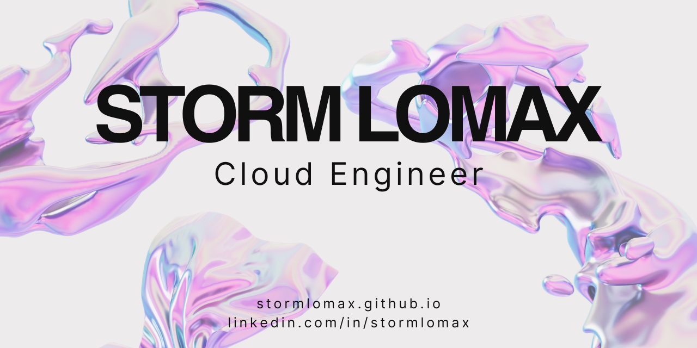

# 💫 About Me:
<table border="0">
 <tr>
    <td>:wave: Hi, I'm Storm Lomax, a Site Reliability Cloud Engineer.   :cloud:I work with Azure and Terraform, and use the GitLab CI/CD pipeline.   :writing_hand:I'm currently working on building an author website, as I publish stories in my spare time. </td>
    <td>currently-reading.png</td>img></td>
 </tr>
</table>

## 🌐 Socials:
 

# 💻 Tech Stack:
              
# 📊 GitHub Stats:
 
 

## 🏆 GitHub Trophies

<!-- Proudly created with GPRM ( https://gprm.itsvg.in ) -->
